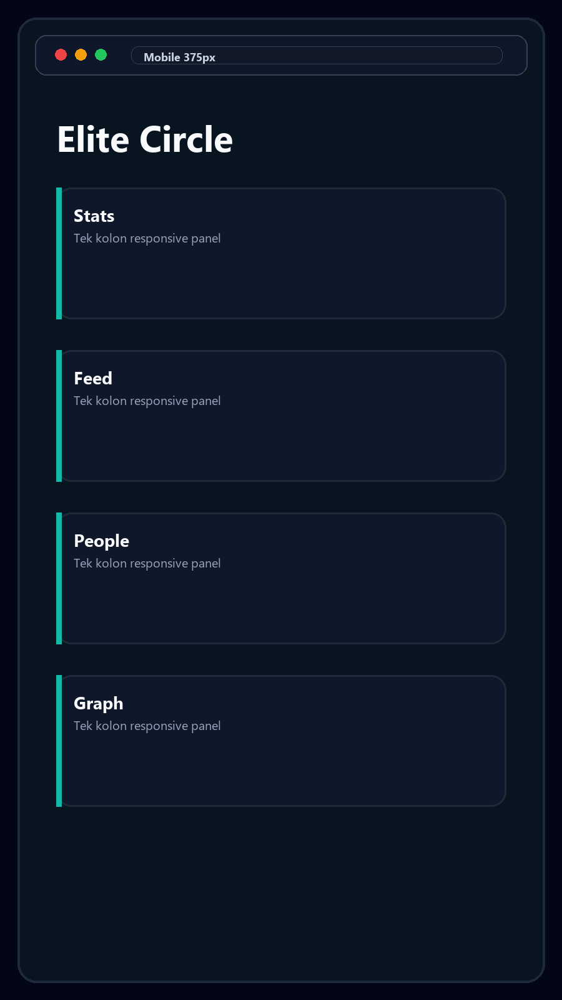
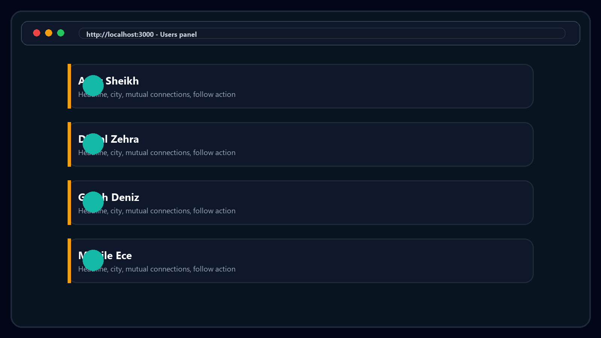
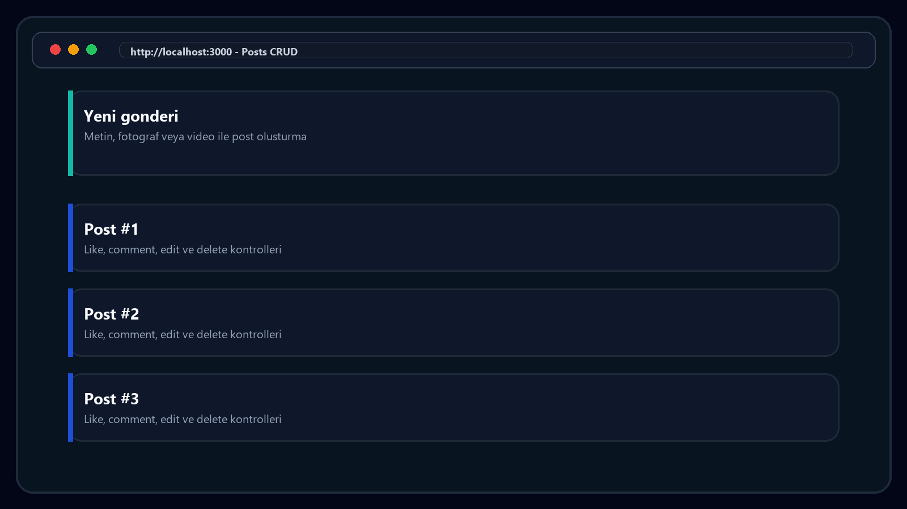
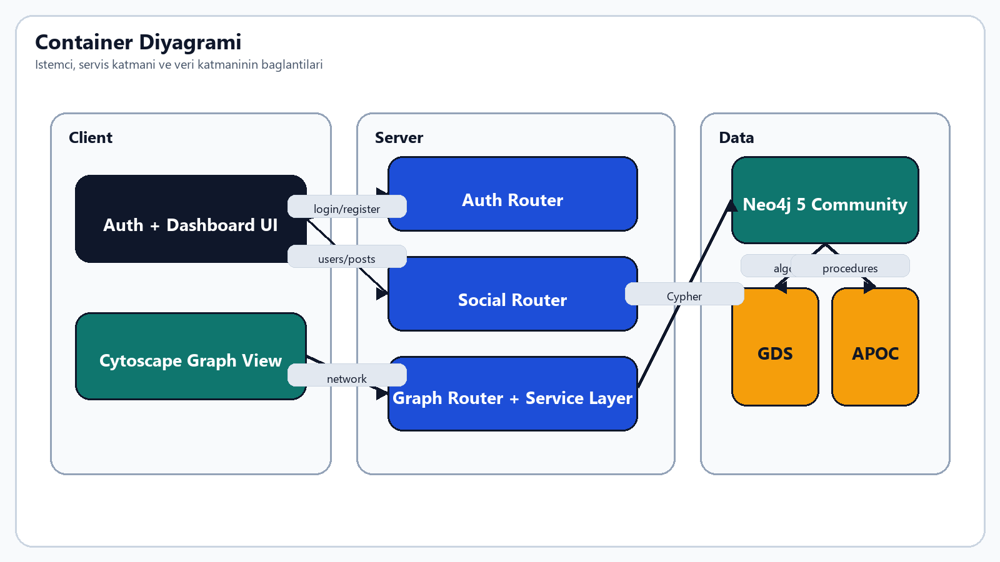

# Neo4j Graph DB Sosyal Ag

> **Neo4j ile sosyal ag grafigi - "arkadasin arkadasi" sorgulari ve aciklanabilir graph analizi**

[](https://github.com/Amir-Sheikhh/final-web-tasarim-project/actions/workflows/ci.yml)


[](LICENSE)


## Ozet

GraphLink, Neo4j uzerinde kullanici, takip, gonderi, begeni, yorum, mesaj ve oturum verilerini property graph modeliyle tutan full-stack sosyal ag demosudur. Proje, iliski yogun sosyal ag problemlerini klasik JOIN zincirleri yerine graph traversal, shortest path, mutual connection ve community detection yaklasimlariyla gosterir.

Uygulama BMU1208 Web Tabanli Programlama final projesi icin gelistirildi. Hedef kitle; graph database ogrenmek isteyen ogrenciler, sosyal ag MVP'si prototiplemek isteyen gelistiriciler ve aciklanabilir tavsiye sistemlerini gormek isteyen teknik degerlendiricilerdir.

## Demo

**Canli Demo:** Bu teslim yerel calisan demo olarak paketlenmistir. Calistirdiktan sonra: `http://localhost:3000`  
**API Docs:** `http://localhost:3000/docs`  
**Neo4j Browser:** `http://127.0.0.1:7474`

**Demo Hesaplari:** Uygulama icindeki `Demo Users` panelinden listelenir. Varsayilan ortak sifre: `demo12345`

Ornek demo hesaplari:

- `aleyna@graphlink.local` / `demo12345`
- `emir@graphlink.local` / `demo12345`
- `kerem@graphlink.local` / `demo12345`

### Ekran Goruntuleri

| Landing | Dashboard | Mobile |
|---------|-----------|--------|
|  |  |  |

| Users | Posts | Graph |
|-------|-------|-------|
|  |  |  |

## Ana Ozellikler

- Kullanici, follow, post, comment, message ve session node/relationship modeli
- "Arkadasin arkadasi" onerisi ve 2-hop traversal
- Ortak baglantilar ve mutual connection analizi
- Skorlanmis ve aciklanabilir kullanici onerileri
- En kisa yol analizi
- Louvain community detection
- PageRank liderleri
- FastRP embedding onizlemesi
- Cytoscape.js ile web icinde graph gorsellestirme
- JWT access token + HttpOnly refresh cookie session modeli
- Refresh token rotation ve Neo4j `Session` node'lari
- Mesajlasma, bildirim merkezi, profil guncelleme ve medya yukleme
- Guvenli payload sinirlari: JSON body limit varsayilan `12mb`, post medya yukleme limiti 8 MB
- REST API, OpenAPI 3.1 ve Swagger UI
- Docker Compose ile Node.js uygulamasi + Neo4j service kurulumu
- GitHub Actions CI: `npm ci`, `npm run check:status`, `docker compose config`, `npm run lint`, `npm audit`, Neo4j seed ve `npm run test:coverage`

## Tech Stack

**Database:** `Neo4j 5 Community`, `Cypher query language`, `APOC library`, `Graph Data Science library`  
**Backend:** `Node.js + Express + neo4j-driver`  
**Frontend:** `HTML + CSS + Vanilla JavaScript + Cytoscape.js`  
**Auth:** `JWT access token + HttpOnly refresh cookie`  
**Deployment:** `Docker Compose veya yerel Neo4j runtime`  
**Test:** `node --test`, `Supertest`, `c8 coverage`, `ESLint`

Teknoloji secimlerinin detayli gerekcesi: [PROJE-RAPORU.md - Bolum 4](PROJE-RAPORU.md#4-teknoloji-yigini-tech-stack)

## Mimari

GraphLink mimarisi uc ana parcadan olusur:

- **Client:** `public/index.html`, `public/styles.css`, `public/app.js`
- **API:** Express server, route/service katmani, auth middleware, validation ve rate limit
- **Database:** Neo4j Community, Cypher sorgulari, GDS/APOC graph algoritmalari



Detayli mimari, C4 diyagramlari ve ADR'lar: [PROJE-RAPORU.md - Bolum 5](PROJE-RAPORU.md#5-sistem-mimarisi)

## Kurulum

### Gereksinimler

- Node.js >= 20
- npm
- Docker Desktop veya calisan Neo4j 5 runtime
- Git

### Docker Compose ile tek komut

```bash
git clone https://github.com/Amir-Sheikhh/final-web-tasarim-project.git
cd final-web-tasarim-project
npm install
npm run docker:up
```

Bu komut `docker-compose.yml` icindeki iki servisi baslatir:

- `app`: Node.js / Express uygulamasi, `http://localhost:3000`
- `neo4j`: Neo4j service, `http://localhost:7474` ve `bolt://localhost:7687`

Kapatmak icin:

```bash
npm run docker:down
```

### Yerel Node + Neo4j kurulumu

```bash
# 1) Repo'yu klonla
git clone https://github.com/Amir-Sheikhh/final-web-tasarim-project.git
cd final-web-tasarim-project

# 2) Environment dosyasi
cp .env.example .env
# .env icinde NEO4J_PASSWORD, JWT_SECRET ve gerekirse COOKIE_SECURE degerlerini duzenleyin

# 3) Bagimliliklari yukle
npm install

# 4) Neo4j servisini hazirla ve baslat
npm run neo4j:setup
npm run neo4j:start

# Windows PowerShell alternatifi
npm run neo4j:setup:windows
npm run neo4j:start:windows

# 5) Demo graph verisini yukle
npm run seed:graph

# 6) Calistir
npm run dev
```

Proje: `http://localhost:3000`

## Test

```bash
npm test
npm run test:coverage
npm run lint
npm run check:status
```

Projede tek test runner kullanilir: `node --test`. Neo4j calismiyorsa database entegrasyon testleri yerelde otomatik skip edilir; CI ortaminda Neo4j service baslatildigi icin DB testleri de kosar.

## Klasor Yapisi

```text
.
├── README.md
├── README.en.md
├── PROJE-RAPORU.md
├── PROJE-RAPORU-SABLON.docx
├── docs/
│   ├── GraphLink_Final_Raporu.docx
│   ├── GraphLink_Gamma_Sunum_Turkce_fixed_working.pptx
│   ├── openapi.yaml
│   ├── swagger.html
│   ├── adr/
│   ├── diagrams/
│   └── report-assets/
├── screenshots/
├── public/
├── src/
├── scripts/
├── test/
├── Dockerfile
├── docker-compose.yml
├── .github/workflows/ci.yml
├── CONTRIBUTING.md
├── CODE_OF_CONDUCT.md
├── SECURITY.md
├── DEPLOYMENT.md
├── CHANGELOG.md
├── REVIEW.md
└── LICENSE
```

## Dokumantasyon

- [PROJE-RAPORU.md](PROJE-RAPORU.md) - uzun form final raporu, markdown ozet/harita
- [PROJE-RAPORU-SABLON.docx](PROJE-RAPORU-SABLON.docx) - uzun form final raporu, Word teslim dosyasi
- [docs/GraphLink_Final_Raporu.docx](docs/GraphLink_Final_Raporu.docx) - repo icindeki asil DOCX rapor kopyasi
- [REVIEW.md](REVIEW.md) - reviewer entry points ve kaynak kod kanitlari
- [docs/code-review-bundle.md](docs/code-review-bundle.md) - tek dosyada kaynak inceleme paketi
- [docs/development-history.md](docs/development-history.md) - commit ve gelistirme gecmisi
- [CONTRIBUTING.md](CONTRIBUTING.md) - katki yapma kilavuzu ve kod kalite standartlari
- [CODE_OF_CONDUCT.md](CODE_OF_CONDUCT.md) - topluluk davranis kodlari
- [SECURITY.md](SECURITY.md) - guvenlik politikasi ve zafiyet bildirim sureci
- [DEPLOYMENT.md](DEPLOYMENT.md) - uretim ortamina yazilim dagitim kilavuzu
- [CHANGELOG.md](CHANGELOG.md) - surum gecmisi ve degisiklikler

## Roadmap

- [x] V1 - MVP: auth, social graph, posts, likes, comments, messaging, dashboard, OpenAPI
- [x] V1 - CI, lint, coverage, Docker Compose ve Neo4j service
- [ ] V2 - Playwright/Cypress E2E ve gorsel regresyon testleri
- [ ] V2 - Live graph refresh ve daha gelismis notification deneyimi
- [ ] V3 - GraphRAG / LLM ile sosyal ag analizi soru-cevap chatbot'u

## Katki

Bu proje **BMU1208 Web Tabanli Programlama** dersi kapsaminda **Bitlis Eren Universitesi** - **Bilgisayar Muhendisligi** bolumunde bir final odevi olarak gelistirilmistir.

Ders yurutucusu: **Dr. Ogr. Uyesi Davut ARI**

Kod katkisi beklenmez, ancak fikir / feedback icin issue acabilirsiniz.

## Lisans

MIT © 2026 **AMIR SHEIKH** - Tam metin icin [LICENSE](LICENSE).

## Iletisim

- **Ogrenci:** AMIR SHEIKH
- **Ogrenci No:** 24080410155
- **E-posta:** laldinsheikh070@gmail.com
- **Ders:** BMU1208 - Web Tabanli Programlama
- **Kurum:** Bitlis Eren Universitesi - Muhendislik-Mimarlik Fakultesi

---

<sub>Bu projede AI destekli kodlama ve dokumantasyon araclari yardimci olarak kullanilmistir. Mimari kararlar, teknoloji tercihleri ve final teslim sorumlulugu ogrenciye aittir.</sub>
