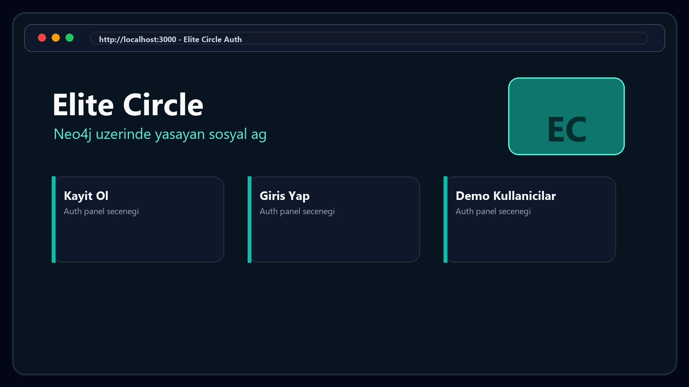
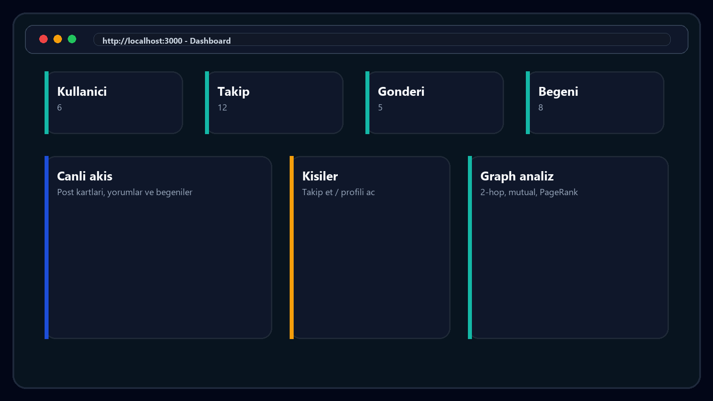
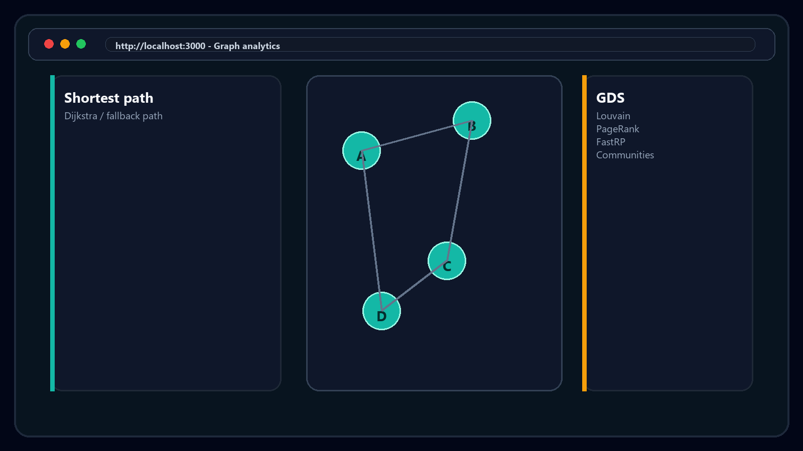

# GraphLink Social - Neo4j Graph DB Sosyal Ag

BMU1208 Web Tabanli Programlama final projesi. GraphLink, Neo4j graph database uzerinde kullanici, takip, gonderi, begeni, yorum ve oturum verilerini modelleyen full-stack bir sosyal ag onerisi demosudur.

## Reviewer Quick Links

Repo linki ile inceleme yapan araclar bazen sadece README ve dosya agacini okuyor; kaynak kod kanitlari icin baslangic dosyasi: [`REVIEW.md`](REVIEW.md).

Tek dosyada kaynak inceleme paketi: [`docs/code-review-bundle.md`](docs/code-review-bundle.md).

En kritik kanit dosyalari:

- Express app, CSP ve body limit: [`src/server.js`](src/server.js)
- Auth, refresh rotation ve password hashing: [`src/services/authService.js`](src/services/authService.js)
- Graph endpointleri: [`src/routes/graph.js`](src/routes/graph.js)
- Social route negative-path testleri: [`test/socialRoutes.test.js`](test/socialRoutes.test.js)
- Security tests: [`test/security.test.js`](test/security.test.js)
- CI + Neo4j service: [`.github/workflows/ci.yml`](.github/workflows/ci.yml)
- Dependency hygiene: [`package.json`](package.json), [`package-lock.json`](package-lock.json)

Son dogrulama komutlari:

```bash
npm run check:status
npm run lint
npm test
```

## Hazirlayan

- Ad Soyad: AMIR SHEIKH
- Ogrenci No: 24080410155

## Demo / Ekran Goruntuleri

Ekran goruntuleri `screenshots/` klasorundedir.





## Kullanilan Teknolojiler

- Backend: Node.js, Express, neo4j-driver
- Database: Neo4j Community, Cypher Query Language
- Graph algoritmalari: Neo4j Graph Data Science, APOC
- Frontend: HTML, CSS, Vanilla JavaScript, Cytoscape.js
- Auth: JWT access token + HttpOnly refresh cookie
- Security / validation: Helmet, cookie-parser, Zod, bcryptjs, rate limiting
- API dokumantasyonu: OpenAPI 3.1 + Swagger UI
- Test: Node.js built-in test runner (`node --test`), Supertest

## Kurulum Adimlari

### Docker Compose ile tek komut

Docker kuruluysa uygulama ve Neo4j birlikte baslatilabilir:

```bash
npm run docker:up
```

Bu komut `docker-compose.yml` icindeki iki servisi ayaga kaldirir:

- `app`: Node.js / Express uygulamasi, `http://localhost:3000`
- `neo4j`: Neo4j Community, `http://localhost:7474` ve `bolt://localhost:7687`

Kapatmak icin:

```bash
npm run docker:down
```

### Yerel Node kurulumu

1. Repoyu klonlayin.

```bash
git clone https://github.com/Amir-Sheikhh/final-web-tasarim-project.git
cd final-web-tasarim-project
```

2. Bagimliliklari kurun.

```bash
npm install
```

3. Ortam dosyasini hazirlayin.

```bash
cp .env.example .env
```

4. Neo4j servisini cross-platform Docker akisiyle hazirlayin.

```bash
npm run neo4j:setup
```

5. Neo4j'i baslatin.

```bash
npm run neo4j:start
```

Windows'ta Docker kullanmak istemeyenler icin eski PowerShell tabanli yerel runtime komutlari da korunur:

```bash
npm run neo4j:setup:windows
npm run neo4j:start:windows
```

6. Demo graph verisini yukleyin.

```bash
npm run seed:graph
```

## Nasil Calistirilir

```bash
npm run dev
```

Uygulama: `http://localhost:3000`

API dokumantasyonu:

- Swagger UI: `http://localhost:3000/docs`
- OpenAPI YAML: `http://localhost:3000/openapi.yaml`
- Neo4j Browser: `http://127.0.0.1:7474`

Test:

```bash
npm test
```

Lint:

```bash
npm run lint
```

Projede tek test runner kullanilir: Node.js built-in test runner. Vitest bagimliligi ozellikle kaldirildi; boylece `node --test` ile package lock arasinda runner uyumsuzlugu yoktur.

Neo4j calismiyorsa database entegrasyon testleri otomatik olarak skip edilir; validation ve security unit testleri calisir.

Repo kalite kontrolu:

```bash
npm run check:status
```

CI:

- GitHub Actions workflow: `.github/workflows/ci.yml`
- Her push ve pull request icin `npm ci`, `npm run check:status`, `docker compose config`, `npm run lint`, Neo4j service seed ve `npm test` calisir.

## Proje Yapisi

```text
src/
  server.js              Express app ve route baglantilari
  config.js              Ortam degiskenleri ve rate limit ayarlari
  db/                    Neo4j driver, seed ve constraint islemleri
  middleware/            Auth, validation, rate limit, request logger
  routes/                Auth, social, graph ve monitoring endpointleri
  services/              Auth, sosyal ag ve graph query is kurallari
  validation/            Zod semalari
public/                  Frontend HTML, CSS, JS ve statik assetler
docs/                    Final raporu, OpenAPI, ADR, diyagramlar
  GraphLink_Gamma_Sunum_Turkce_fixed_working.pptx
screenshots/             Demo ekran goruntuleri
scripts/                 Neo4j kurulum/baslatma ve rapor uretimi
test/                    Unit ve integration testleri
```

## One Cikan Ozellikler

- Neo4j property graph modeli: `User`, `Post`, `Session` node tipleri.
- Iliski modeli: `FOLLOWS`, `AUTHORED`, `LIKED`, `HAS_SESSION`, yorum ve bildirim akislari.
- Arkadasin arkadasi sorgulari: 2-hop traversal ile ikinci derece baglantilar.
- Iliski tabanli oneriler: mutual connection, takip ve begeni sinyallerinden aciklanabilir oneriler.
- Benzer icerik mantigi: kullanicinin begendigi gonderilerden ve benzer sosyal sinyallerden feed/recommendation uretimi.
- Graph analizi: Louvain community, PageRank, FastRP embedding preview, shortest path.
- Cytoscape.js ile web icinde network gorsellestirme.
- Neo4j Browser ile graph verisini ayrica inceleme.
- JWT auth, refresh rotation, logout session revoke.
- OpenAPI 3.1 dokumantasyonu ve Swagger UI.

## Karsilasilan Zorluklar ve Cozumler

- Graph DB paradigmasi: SQL tablolari yerine node-edge-property modeli kuruldu. Sosyal ag icin iliskiler dogrudan graph relationship olarak tasarlandi.
- Cypher sorgulari: Arkadasin arkadasi, mutual connection ve recommendation sorgulari servis katmaninda parcalanarak okunabilir hale getirildi.
- GDS/APOC kurulumu: Docker Compose varsayilan cross-platform akistir; Windows PowerShell runtime komutlari alternatif olarak korunur.
- Auth guvenligi: Tokenlar localStorage yerine HttpOnly cookie ile tutuldu; refresh token hashlenerek Neo4j session node'unda saklandi.
- Demo tekrarlanabilirligi: `npm run seed:graph` komutu ile ayni graph verisi tekrar uretilebilir hale getirildi.
- Payload guvenligi: JSON body limit varsayilan olarak `12mb`; post medya yuklemeleri 8 MB binary limit ile sinirlandirilir.

## Kaynaklar

- Neo4j Documentation: https://neo4j.com/docs/
- Cypher Manual: https://neo4j.com/docs/cypher-manual/current/
- Neo4j Graph Data Science: https://neo4j.com/docs/graph-data-science/current/
- APOC Documentation: https://neo4j.com/docs/apoc/current/
- Cytoscape.js Documentation: https://js.cytoscape.org/
- Express Documentation: https://expressjs.com/
- OWASP Top 10: https://owasp.org/Top10/
- OpenAPI Specification: https://spec.openapis.org/oas/latest.html

## Degisiklik Gecmisi

### v1.3.0 (Mayis 2026)

Teslim ve calistirilabilirlik iyilestirmeleri:

- Docker Compose eklendi: uygulama ve Neo4j tek komutla baslatilabilir.
- GitHub Actions CI eklendi: `npm ci`, `npm run check:status`, `docker compose config`, `npm run lint`, Neo4j service seed ve `npm test`.
- Test runner uyumsuzlugu giderildi: Vitest bagimliligi kaldirildi, tek kaynak `node --test`.
- Neo4j komutlari cross-platform Docker akisini varsayilan olarak kullanacak sekilde guncellendi; PowerShell komutlari Windows alias'i olarak korundu.
- ESLint config eklendi ve CI pipeline'a baglandi.
- `swagger-ui-dist` Scarf telemetry bagimliligi olmayan surume pinlendi.
- Social route negative-path testleri eklendi; auth, validation ve role guard hatalari route seviyesinde dogrulaniyor.
- GitHub Actions artik Neo4j service container baslatip `npm run seed:graph` sonrasi testleri calistirir.
- Upload cleanup hatalari sessizce yutulmak yerine structured warning olarak loglanir.
- JSON body limit `30mb` hardcode degerinden config tabanli `12mb` varsayilanina indirildi.
- PowerPoint dosyasi repo root'undan `docs/` klasorune tasindi.
- Repo self-check kapsami Docker, CI ve teslim dosyalarini da dogrulayacak sekilde genisletildi.

### v1.2.0 (Mayis 2026)

Kalite ve Test Iyilestirmeleri:
- ✅ XSS Sanitization: `escapeHtml()` ile post ve yorum icerigini HTML escape
- ✅ Pagination: `/api/posts` ve `/api/users` endpointlerine limit/offset desteği
- ✅ Unit Tests: Neo4j olmadan calisan sanitize, pagination ve validation testleri
- ✅ GraphService Fallback: GDS/APOC plugin'leri yok oldugunda graceful fallback
- ✅ OpenAPI Dokumantasyon: Pagination parametreleri OpenAPI spec'e eklendi

Test Coverage:
- `test/sanitize.unit.test.js` - HTML escaping ve XSS prevention testleri
- `test/pagination.unit.test.js` - Limit/offset parametresi validation testleri
- `test/socialService.test.js` - Validation ve sanitization testleri
- `test/graphService.unit.test.js` - Graph plugin availability testleri
- `test/validation.test.js` - Schema validation kapsamı

Test Komutu:
```bash
npm test  # Tum testler (47 pass, database yok ise skip)
```

### v1.1.0

- Guvenlik: post ve yorum icerigine XSS sanitizasyon eklendi.
- Ozellik: `/api/posts` ve `/api/users` endpointlerine `limit`/`offset` pagination eklendi.
- Test: Neo4j olmadan calisan sanitize, validation ve graph runtime unit testleri eklendi.
- Dokumantasyon: OpenAPI spec'e pagination parametreleri eklendi.

### v1.0.0

- Ilk surum: Neo4j graph modeli, JWT auth, Cytoscape gorsellestirme ve OpenAPI dokumantasyonu.

## Lisans

MIT. Ayrinti icin `LICENSE` dosyasina bakiniz.
